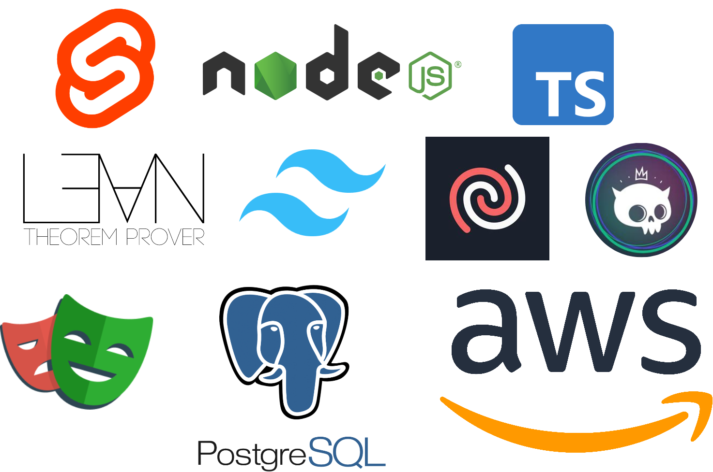
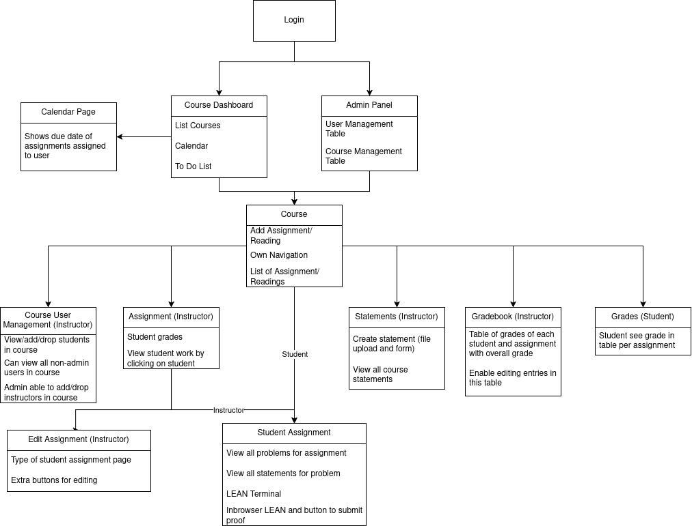
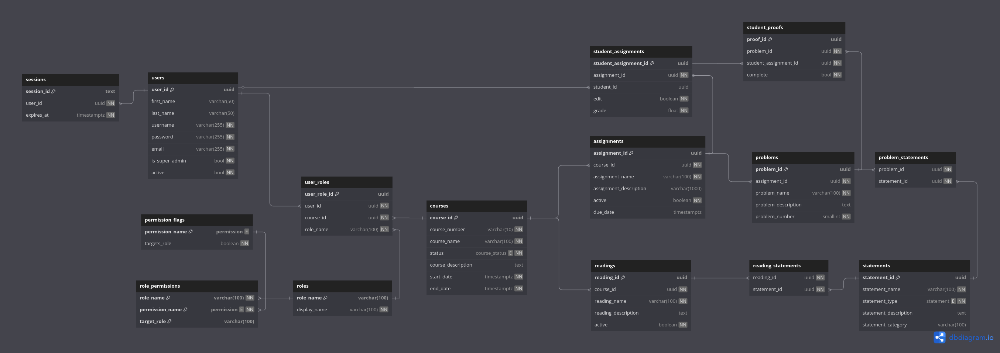

# Design Documentation
LEMMA is a Learning Management System (LMS) intended to focus on providing a platform for students to do assignments that are mathematical proofs and get immediate correctness feedback and automatic grading. The product is intended to be used along side existing LMS platforms for a college proof-based course such as Discrete Math.

## Tech Stack

## File Structure
LEMMA has many files and directories to support the project. Most of the project's file structure is dictated by SvelteKit as the product used a Sveltekit project.

### Directories
- `data` - Directory for all `sql` files used for the project. This contains the schema, database triggers, necessary roles data, and sample data. It also contains the `create_init.sh` script to create `init_db.sql` file that can be included into postgres to populate the database. The structure of the numbering is for ordering of what is needed to be populated
  - 0* - Schema level files and triggers
  - 1* - Role related files
  - 2* - Users and courses related files
  - [3-9]* - Sample Data
- `utils` - Additional utilities useful for the project. 
- `build` - Generated files when building the project with `npm run build` needed for production/deployment
- `docs` - Documentation files in markdown form along with diagrams for the project such as database diagram and webflow.
- `Projects` - A lean4monaco project part of what is needed for the lean editor on the site.
- `patches` - Patches for the lean4monaco for additional features needed for the project.
- `static` - Static files used for the project of favicons but could've contain static images by [Sveltekit](https://svelte.dev/)
- `src` - The source code of backend and frontend code by [Sveltekit](https://svelte.dev/)
  - `src/lib/components` - frontend components used for the project. Additionally, the `client` directory contains the Datatable integration from Skeleton UI.
  - `src/lib/server` - backend code for authentication and database connections.
  - `src/routes` - frontend pages and api routes
  - `src/@types` - additional types needed for typescript
- `tests` - The files for doing unit and integration testing of our product

### Files
Specific files important for the project that aren't documented elsewhere.

- `.env` - Environment variables needed for project with the names in `.env.example` and documented in the `README.md`
- `jsdoc.json` - Configuration for JSDoc for automatically hosting code documentation

## Frontend
This project is a website and has several pages to support the LMS structure. 

### Technologies
- [SvelteKit](https://svelte.dev/) (svelte v5 and sveltekit v2.16) - main language to write the frontend code and controls the file structure of the project
- [TailwindCSS](https://tailwindcss.com/) (v3.4.9) - main language used for styling the web pages. 
- [Skeleton UI](https://www.skeleton.dev/) (v2.11) - a library that consist of many UI componants and additional tailwindcss classes for their components
- [Lucide Icons](https://lucide.dev/) (v0.479) - a library that consist of many icons 

### Web Flow

The frontend consist of several pages. The above diagrams describes the flow between all of the pages of the website and the main purpose of each page.
- Login Page: This is the first page that the users will encounter.  It features a login form with fields for entering username and password. Upon successful authentication, the user is directed to the home page.   
- Admin Panel: This page allows management of users and courses. This is the admin user's home page and the page they get directed to upon login.
- Course Dashboard Page: This page displays differently based on the type of user.  Students are able to view all courses that they are enrolled in, represented as clickable icons which leads them to their respective course pages  
- Calendar Page: This page displays a calendar, which provides an overview of all assignment deadlines or events across a user's enrolled courses. It is designed to help students and instructors stay organized by displaying due dates and upcoming events  in a structured format.
- Course Page: This page is arguably the most essential page in our design.  It provides different functionalities based on the type of user. Students can view upcoming assignments, instructors can manage course content and assignments, and admins can manage user roles and configure system settings.  
- Course User Page: This page displays a list of all students and instructors enrolled in a specific course, along with their respective roles, providing a quick reference for users to see who is participating in a course.
- Statements Page: This page was intended to enable instructors to manage the tactics, theorems, and definitions used in the class. This would've enabled students to be restricted on what they could use for the problems and use previously proven theorems in later assignments. However, due to complexity and time-constraints this was not integrated into the student assignment page and this page is an artifact of a page that doesn't have a use.
- Gradebook Page: This page displays grades for every student on every assignment with their  letter grade.  It is accessible exclusively to instructors, allowing them to view students’ performances and modify grades if necessary.
- Grades Page: This page displays grades for each assignment based on completion.  It is accessible exclusively to students, allowing them to view their grades for the course. 
- Assignment Page: This page contains the assignments of each student and viewable by instructors to enable them to view what students have done in the assignments. This is where they can go to the edit assignment page to edit the assignment.
- Student Assignment Page: This page displays the problems within the assignments and a lean editor to allow students to complete the problem. 
- Edit Assignment Page: This page is a type of student assignment page but has several buttons to enable editing the assignment such as adding problems and problem description.

## Backend
This project has to integrate authentication, database, and method of handling lean files.

### Technologies
- AWS - deployment on a ec2 ubuntu (v24.04.2 LTS) instance
- [PostgreSQL](https://www.postgresql.org/) (v16.8) - Database deployed on the ec2 instance
- [Lucia](https://lucia-auth.com/) (v3.2.2) - Integration for secure username and password logins
- [lean4monaco](https://github.com/hhu-adam/lean4monaco) (v1.0.46) - plugin to support the `vscode-lean4` vscode extension for lean on a browser. This enables writing in the webpage with a LSP and giving output client side automatically.
  - [LEAN](https://lean-lang.org/) (v4.18.0) - language used for writing proofs
  - Bubblewrap - containerization to have the code execute in containers for security
- [Playwright](https://playwright.dev/) (v1.51.1) - Automatic testing suite for unit and integration tests for backend and frontend testing

### Database

Our project will have multiple users, namely students, instructors, and admin, who have different levels of permissions. To accommodate this and for scalability, we separate the possible permissions a user can have, which then we can create a role and add permissions to that role. Roles are assigned to users to give them the necessary permissions. 
As an LMS, we have courses to manage, which include the ability to assign the start/end date, active/inactive, and course name and description. Students and instructors will be assigned to courses with the `user_roles` table with the course and the role they have in the course. This also enables instructors to take a course as a student. The assignments can be set to active to enable students to view and work on the assignments and inactive to enable instructors to work on the assignment before letting students work on it.

For the assignments, these can have multiple problems. For each problem, there are multiple statements for it, which are allowed to be used. The `assignment` has due dates and whether the assignment is active or not. The `student_assignments` contain data about a specific assignment and student pair such as their grade and what `student_proofs` correspond for that assignment. The `edit` field is used to determine if it's the student assignment that is what the instructor uses to edit the assignment. 

For each problem, students have their own LEAN file to write in to prove the problem statement. These need to be saved to enable students to go back to previous work or continue where they left off. Each problem is a completion grade on whether the problem statement is proven or not. The assignment grade is based on how many of the problems were completed.

The `sessions` are from integrating [Lucia](https://lucia-auth.com/) and simply just stores the values for sessions that corresponding to a user and when the session expires. Client side, they recieve the session id as part of a cookie and when they use the website the session id is used to determine what user and thus permissions they have.

The `statements` table was not used for the project due to time constraints. These are tactics (lean functions such as applying a theorem to the problem statement), definitions (new symbols), theorems (main statements that can be applied to prove the problem statement), and problems (the problem statement). The statement category allows for creating tabs for definitions and theorems on the front end to make going through the many statements easier. The statements have a description, which when students look at the tactics, definitions, or theorems, allows instructors to provide a more easily understandable description for the students. The theorems and definitions are separated as to enable students to reference each file independently as a reference that may help with understanding the theorem or some tricks on how to solve their homework problems.

Similarly, the `readings` table was not used for the project due to time constraints. This was intended to enable students to have readings in LEAN both as example proofs in LEAN and give additional details that an instructor could've written for course content.

### Generated Backend Files
This project generates multiple files such as the lean files for student proofs and problem files. These files are stored in the directory by specified by the environment variable `DATAROOT`. All files are named by their `uuid` in the database without an extension. For example, `${DATAROOT}/proofs/0761529a-8936-42a7-b6e7-481a1a2afc3f`. There are four main subdirectories:
- `problems` - The problem files created by instructors that are used to specify what theorem/statement that students are supposed to prove.
- `proofs` - The proofs that students write that prove the theorem/statement made in the problem files
- `statements` - The files for statements mentioned in the [Database](#database) section that are not used due to time constraints
- `reading` - The files for readings mentioned in the [Database](#database) section that are not used due to time constraints

## Other Details
To get `lean4monaco` working, we needed the package to use `memfs` instead of node's `fs`. 
We use nodePolyFills to replace this as that appear to be the convention. 
This replaces `fs` with `memfs` when our project does need `fs` to write and read files on the server, therefore we use `zlib` that gets replaced with `fs` to use `fs` in our project.
